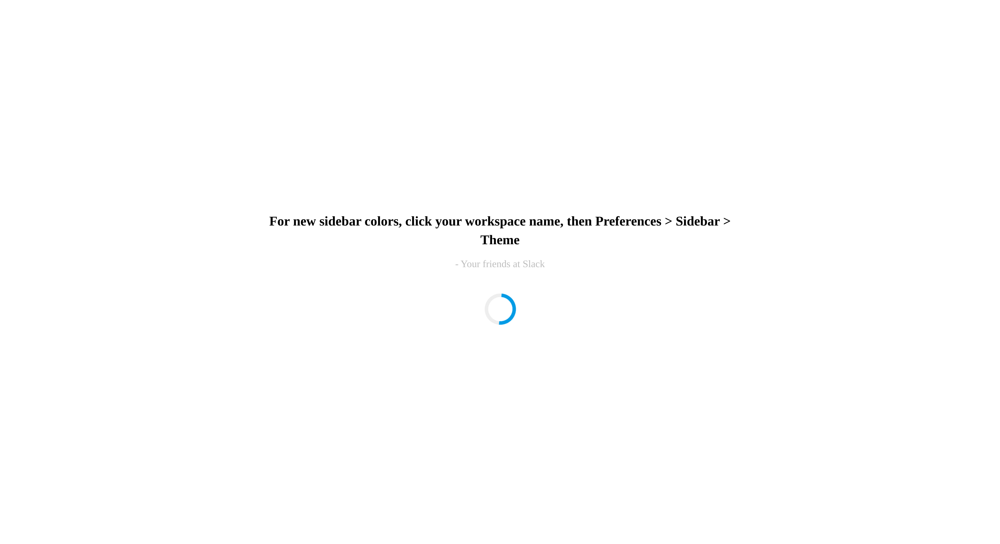

# Loading Animation

This is a simple web page that displays a loading animation with a message.

## Table of Contents
- [Description](#description)
- [Screenshot](#screenshot)
- [Usage](#usage)
- [Author](#author)
- [License](#license)

## Description

This web page features a loading animation along with a message and author attribution. It is designed to provide a user-friendly loading experience.

## Screenshot

## Usage

1. Clone this repository to your local machine.
2. Open the `index.html` file in a web browser to view the loading animation.

## Author

- Aditya Kumar
- GitHub: (https://github.com/adityakumargithub)

## License

This project is licensed under the MIT License.
